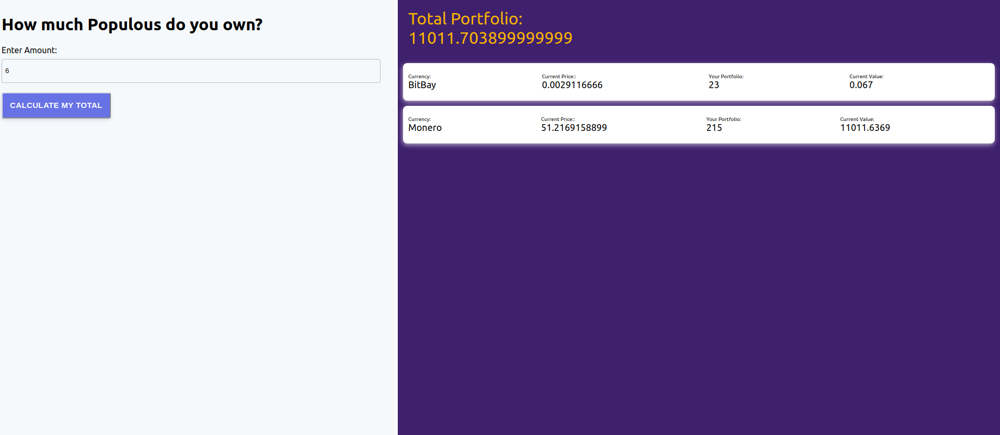

[![Contributors][contributors-shield]][contributors-url]
[![Forks][forks-shield]][forks-url]
[![Stargazers][stars-shield]][stars-url]
[![Issues][issues-shield]][issues-url]
[![LinkedIn][linkedin-shield2]][linkedin-url2]
[![Hireable][hireable]][hireable-url]

<!-- PROJECT LOGO -->
<br />
<p align="center">
 <h2 align="center"> CryptoCurrency Calculator</h2>

  <p align="center">
      In this project We'll put together a CryptoCurrency Calculator with Ruby and Rails and React 
    <br />
    <a href="https://github.com/YairFernando67/Crypto-Calculator"><strong>Explore the docs »</strong></a>
    <br />
    <br />
    <a href="https://github.com/YairFernando67/Crypto-Calculator">View Demo</a>
    ·
    <a href="https://github.com/YairFernando67/Crypto-Calculator/issues">Report Bug</a>
    ·
    <a href="https://github.com/YairFernando67/Crypto-Calculator/issues">Request Feature</a>
  </p>

</p>

## Table of Contents
* [About the Project](#about-the-project)
  * [JSX](#JSX)
  * [Html vs JSX](#Differences-between-html-and-jsx)
  * [Class Components](#Class-Components)
  * [Reusable Components](#Reusable-Components)
  * [Component Nesting](#Component-Nesting)
  * [Component Resuability](#Component-Resuability)
  * [Component Configuration](#Component-Configuration)
  * [Built With](#built-with)
* [Required Installations](#Required-Installations)
  * [Prerequisites](#Prerequisites)
  * [Installing](#Installing)
  * [Instructions](#Instructions)
  * [Serve Project](#Serve-Project)
* [Contact](#contact)
* [Contributing](#Contributing)
* [Show your support](#Show-your-support)
<!-- ABOUT THE PROJECT -->

## About The Project

 

### JSX
<p> 
  JSX is essentially pure JavaScript but browsers do not know how to read JSX
  so that's why we use Babel to convert it into JavaScript.
</p>

### Differences between html and jsx:
* Adding custom stying to an element uses different syntax
* Adding a class to an element uses different syntax-> Use className="btn"
* JSX can reference JS variables very easly.
* Diferent syntax for the for property on labels use this syntax htmlFor="name"

### Class Components

<h4>Benifits</h4>
  
* Easier code organization
* Can use 'state'(another React system) -->Make it easier to handle user input
* Understands lifecycle events --> Make it easier to do things when the app first starts

<h4>State</h4>

* It its only usable with class base components --> Technically can be used with functional components using the "hooks" system
* You will confuse props with state
* 'State' is a JS object that contains data relevant to a component
* Updating 'state' on a component causes the component to (almost) instantly rerender
* State must be initialized when a component is created
* State can only be updated using the function 'setState'

### Reusable Components

- PROPS
  <p> 
  It is a system for passing data from a parent 
  component to a child component
  Its goal is to customize or configure a child
  component
  When we use the props system, there are two
  stages.
  The first one is when we want to provide information
  from the parent to the child
  The second one is when the child makes use to this
  information.
  </p>

### Some concepts of a component in REACT:

#### Component Nesting

- A component can be shown inside of another

#### Component Resuability

- We want to make components that can be easily reused through out application

#### Component Configuration

- We should be able to configure a component when it is created

### Built With
The project was developed using the following technologies:
- [React](https://es.reactjs.org/)
- [JSX](https://reactjs.org/docs/introducing-jsx.html)
- [Axios](https://github.com/axios/axios)
- [Ruby](https://www.ruby-lang.org/es/)
- [Ruby on Rails](https://rubyonrails.org/)

## Required Installations

### Prerequisites

This project runs on [Ruby](https://www.ruby-lang.org/en/documentation/installation/), and [Rails](http://installrails.com/)

* Node
* NPM
* Ruby
* Rails

After installation, run `ruby -v` to make sure Ruby installed correctly. Example
```
$ ruby -v
ruby 2.6.4p104 (2019-08-28 revision 67798) [x86_64-linux]
```

Also make sure that Rails is installed, but running `rails -v`. 
Example
```
$ rails -v
Rails 6.0.2.1
```

### Installing

<p>Install the following to get this project running in your machine:</p>

### Instructions

<p>Follow these steps:</p>

Clone the Repository

```Shell
user@pc:~$ git clone https://github.com/YairFernando67/Crypto-Calculator
```

Click on the console and to go to the folder that was created

```Shell
user@pc:~$ cd Crypto-Calculator
```

This project uses [Postgresql](https://tecadmin.net/install-postgresql-server-on-ubuntu/)

Installing dependencies

```Shell
user@pc:~/Crypto-Calculator$ bundle install --without production
```

```Shell
user@pc:~/Crypto-Calculator$ rails db:create
```

```Shell
user@pc:~/Crypto-Calculator$ rails db:migrate
```

Run this command if you encountered a problem runing rails db:migrate

```Shell
user@pc:~/Crypto-Calculator$ bundle exec rails db:migrate
```

### Serve Project

Open two tabs on the console on the same folder Crypto-Calculator

Start the local server with rails:

```Shell
user@pc:~/Crypto-Calculator$ rails s
```

Start the local server with react:

```Shell
user@pc:~/Crypto-Calculator$ ./bin/webpack-dev-server
```

Open your browser on [http://localhost:3000](http://localhost:3000)


## Contact

👤 **Yair Fernando Facio**

<a href="https://yairfernando67.github.io/Portfolio/" target="_blank">
    
   

</a>

- Github: [@YairFernando67](https://github.com/YairFernando67)
- Twitter: [@YairFernando18](https://twitter.com/YairFernando18)
- Linkedin: [softwaredeveloperyairfacio](https://www.linkedin.com/in/softwaredeveloperyairfacio/)
- Email: [yair.facio11@gmail.com](https://mail.google.com/mail/?view=cm&fs=1&tf=1&to=yair.facio11@gmail.com)
- Portfolio: [softwaredeveloper](https://yairfernando67.github.io/Portfolio/)

<p align="center">

  Project Link: [https://github.com/YairFernando67/Crypto-Calculator](https://github.com/YairFernando67/Crypto-Calculator)

</p>

## 🤝 Contributing

Contributions, issues and feature requests are welcome!

Feel free to check the [issues page](https://github.com/YairFernando67/Crypto-Calculator/issues).

## Show your support

Give a ⭐️ if you like this project!

<!-- MARKDOWN LINKS & IMAGES -->
[contributors-shield]: https://img.shields.io/github/contributors/YairFernando67/Crypto-Calculator.svg?style=flat-square
[contributors-url]: https://github.com/YairFernando67/Crypto-Calculator/graphs/contributors
[forks-shield]: https://img.shields.io/github/forks/YairFernando67/Crypto-Calculator.svg?style=flat-square
[forks-url]: https://github.com/YairFernando67/Crypto-Calculator/network/members
[stars-shield]: https://img.shields.io/github/stars/YairFernando67/Crypto-Calculator.svg?style=flat-square
[stars-url]: https://github.com/YairFernando67/Crypto-Calculator/stargazers
[issues-shield]: https://img.shields.io/github/issues/YairFernando67/Crypto-Calculator.svg?style=flat-square
[issues-url]: https://github.com/YairFernando67/Crypto-Calculator/issues
[license-shield]: https://img.shields.io/github/license/YairFernando67/Crypto-Calculator.svg?style=flat-square
[license-url]: https://github.com/YairFernando67/Crypto-Calculator/blob/master/LICENSE.txt
[linkedin-shield2]: https://img.shields.io/badge/-LinkedIn-black.svg?style=flat-square&logo=linkedin&colorB=555
[linkedin-url2]: https://www.linkedin.com/in/softwaredeveloperyairfacio/
[hireable]: https://cdn.rawgit.com/hiendv/hireable/master/styles/flat/yes.svg
[hireable-url]: https://www.linkedin.com/in/softwaredeveloperyairfacio/
